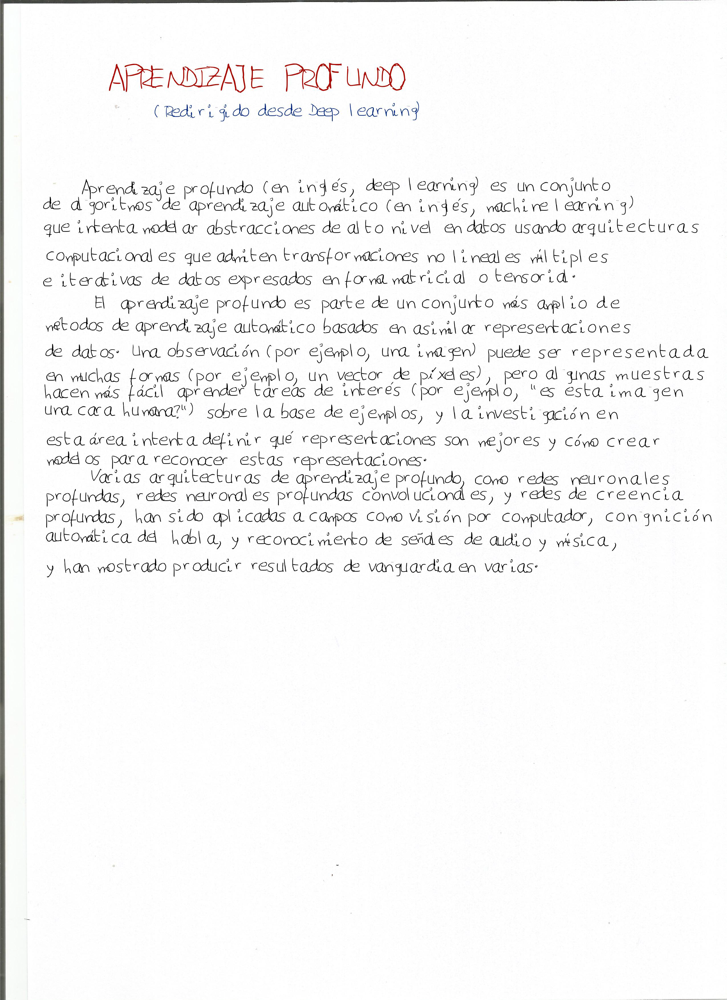

# Believable-Human-Writting-Conversor
A script that transforms any text to human-like writing.

Tired of being asked by my teachers to not do any essay in the PC and to write them by hand... I decided to create a font with my hand-writing and then a Python script to do a bunch of stuff:

1. Adds random effects (the letter separation, paragraph separation, the indent, line inclination).
2. Knows how to jump line and not cut any word. Same with pages.
3. Auto .pdf save.
4. TOTALLY CUSTOMIZABLE!

## How to customize
Yoy can change the text, color and size, x and y coordinates and more. Introducing commands. They all have to start and end with the wiggle: "/~".
**\~C~:** Specifies the color in RGB format ie: _~C(45, 120, 255)_. Also has the predefined red-blue-black pen colors ie: _~Cred~_ or _~Cblue~_ ...
**~S~:** Specifies the text size, default is like 100, ie: _~S200~_.
**~#~:** Converts any number in number format to string, ie: _~#210~_ will output: two-hundred and ten.
**~T~:** Moves the x coordinate in pixels, ie: _~T140~_.
**~P~:** Moves the y coordinate in pixels, ie: _~P200~_.
**~R~:** Resets the default text color and size, ie: _~R~_.

Also the script lets you specify the default values at the begginig of the text to convert. Simply put ":" at the start of the first line and then you can change variable values separated by comma-spacing ", ". The values you can change with the default values speak for themselves: 

```python
font_size = initial_font_size
paragraph_rand_spacing = (font_size - font_size // 2, font_size)
initial_y = 200
indent_rand = (120, 130)
new_line_indent = 1.3
word_rand_spacing_range = (font_size // 3.5, font_size // 3.5 + font_size // 10)
delta_y_rand_gaussian = (0, 0.8)  # a normal-distributed random for the inclination of each line
special = '~'  # special character for commands
read_command = False
color = (0, 0, 0) 
```

As said, for example, if you want to change the default color and the initial text y coordinate just let the first line of your .txt be:
_:color=(255,0,0), initial_y=50_

And there you go! Just paste some text in a .txt file (text.txt) and the program will do the rest. To make a font with your hand-writing, print the templates and scan them in the https://www.calligraphr.com/ webpage (you may have to exclude some characters or pay the full version...). Here is how it looks:




